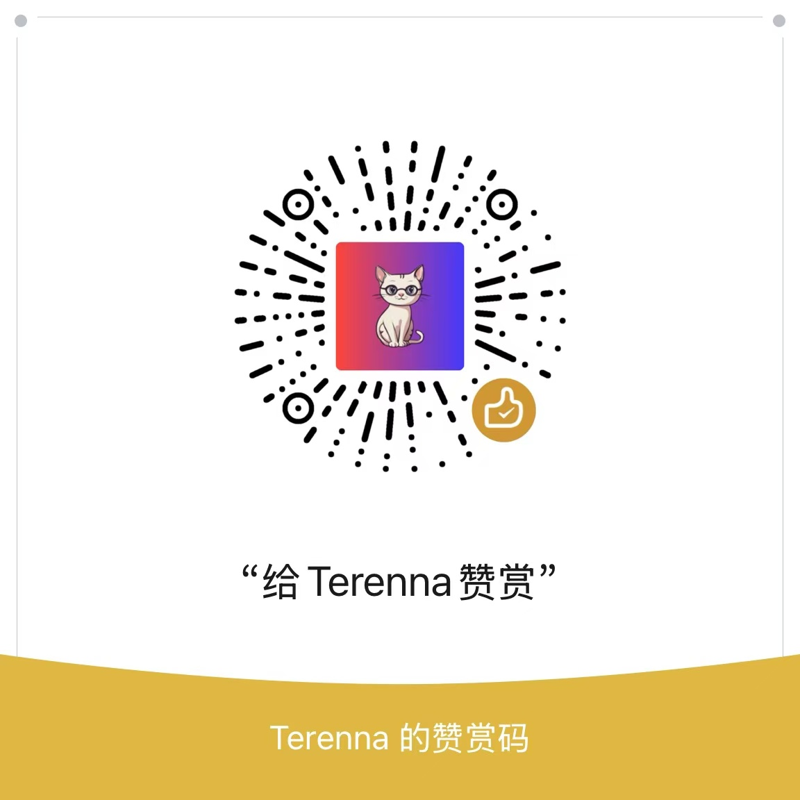

# Windows 开发开发人员工具箱 ( 程序猿辅助工具 )

本项目收集在开发过程中可能会遇到的一些需要辅助的功能, 比如变量明明, 屏幕取色等等...

项目采用 Tauri + Rust + Vue3 + Vite + Tailwind CSS 进行开发

部分功能由于实现复杂，则直接内嵌第三方工具站点网页界面, 如有版权问题, 请通过下方联系方式或提交 issues 进行移除

## 联系方式

微信: terenna
邮箱: tianxidev.wiki

## 界面预览


## 功能清单

### 开发辅助

- [X] 变量名风格转换
- [ ] Json 字符串格式化
- [X] 翻译

### 操作系统辅助

- [ ] Windows 音频同步

## 开发

```
npm run tauri dev
```

## 编译

```
npm run tauri build
```

## 赞助

